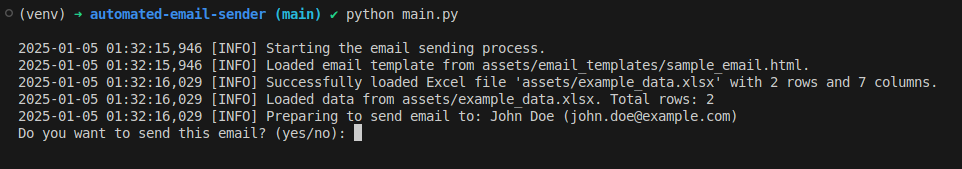

[](LICENSE)
[](https://www.python.org/)
[](https://github.com/cristobalpina/automated-email-sender/actions/workflows/lint.yml)

# Automated Email Sender

## 📨 Description

Automated Email Sender is an open-source Python project designed to automate the sending of personalized emails using Gmail. It processes recipient data from a spreadsheet and includes features like customizable HTML signatures, manual confirmation for each email, and robust error handling.

This project is ideal for small businesses, HR teams, or developers looking to streamline email communications with a reusable and extendable solution.

## ✨ Features
- 📄 Spreadsheet Integration: Reads recipient data directly from an Excel file.
- 💌 HTML Email Support: Includes a customizable and professional HTML signature.
- ✅ Manual Confirmation: Confirms email details before sending.
- 🛡️ Error Handling: Detects and reports missing files or SMTP issues.
- 🌍 Open Source: Designed to be reusable and extensible.

## 📂 Project Structure
```
automated-email-sender/
├── .gitignore              # Ignore sensitive/unnecessary files
├── .pre-commit-config.yaml # Pre-commit hook configuration
├── .flake8                 # Linting configuration
├── LICENSE                 # Open-source license
├── README.md               # Project documentation
├── requirements.txt        # Python dependencies
├── main.py                 # Main entry point for the project
├── email_sender.py         # Functions to send emails
├── excel_handler.py        # Functions to load and process Excel data
├── utils.py                # Helper functions for validation and templating
├── settings.py             # Configuration and environment variables
├── assets/
│   ├── email_templates/sample_email.html  # Example HTML email template
│   ├── signatures/sample_signature.html   # Example HTML email signature
│   ├── data_example.xlsx                  # Example spreadsheet for recipient data
```
## 🛠️ Setup and Installation

### 1. Clone the Repository
```bash
git clone https://github.com/cristobalpina/automated-email-sender.git
cd automated-email-sender
```

### 2. Create and activate Virtual Environment
Set up a virtual environment to manage dependencies:
```bash
python3 -m venv venv
source venv/bin/activate  # On Windows: venv\Scripts\activate
```

### 3. Install Dependencies
Install the required Python libraries:
```bash
pip install -r requirements.txt
```

### 4. Configure the Project

Create a .env file to securely store your Gmail credentials:
```
# SMTP Configuration
SMTP_SERVER=smtp.gmail.com
SMTP_PORT=587
EMAIL=your_email@gmail.com
PASSWORD=your_app_specific_password
SENDER_NAME=Your Name

# File Paths
HTML_SIGNATURE_PATH=assets/signatures/sample_signature.html
TEMPLATE_PATH=assets/email_templates/sample_email.html
DATA_PATH=assets/data_example.xlsx

# Email Subject
EMAIL_SUBJECT=Your Default Email Subject

```
Note: Replace your_email@gmail.com and your_app_specific_password with your Gmail credentials. For Gmail, generate an [App Password](https://support.google.com/accounts/answer/185833?hl=en) to ensure security.

### 5. Configure Pre-Commit Hooks (Optional)

This project uses `flake8` for formatting for linting. Pre-commit hooks are included to enforce these standards automatically when committing changes.

To enable pre-commit hooks:
```bash
pip install pre-commit
pre-commit install
```

## 🚀 Usage

### 1. Activate the Virtual Environment
Before running the project, ensure your virtual environment is active:
```bash
source venv/bin/activate
```

### 2. Run the Project
Execute the script to start sending emails:
```bash
python main.py
```

### 3. Follow Interactive Prompts

- Review email details for each recipient.
- Confirm whether to send the email.



## 📜 License
This project is licensed under the MIT License. See the LICENSE file for more details.

## Future Improvements
- Automate email scheduling with advanced task schedulers.
- Add file attachment functionality.
- Generate reports for sent and skipped emails.

# 👨‍💻 Author
**cristobalpina**

Feel free to reach out with feedback or questions: fcristobalp11@gmail.com